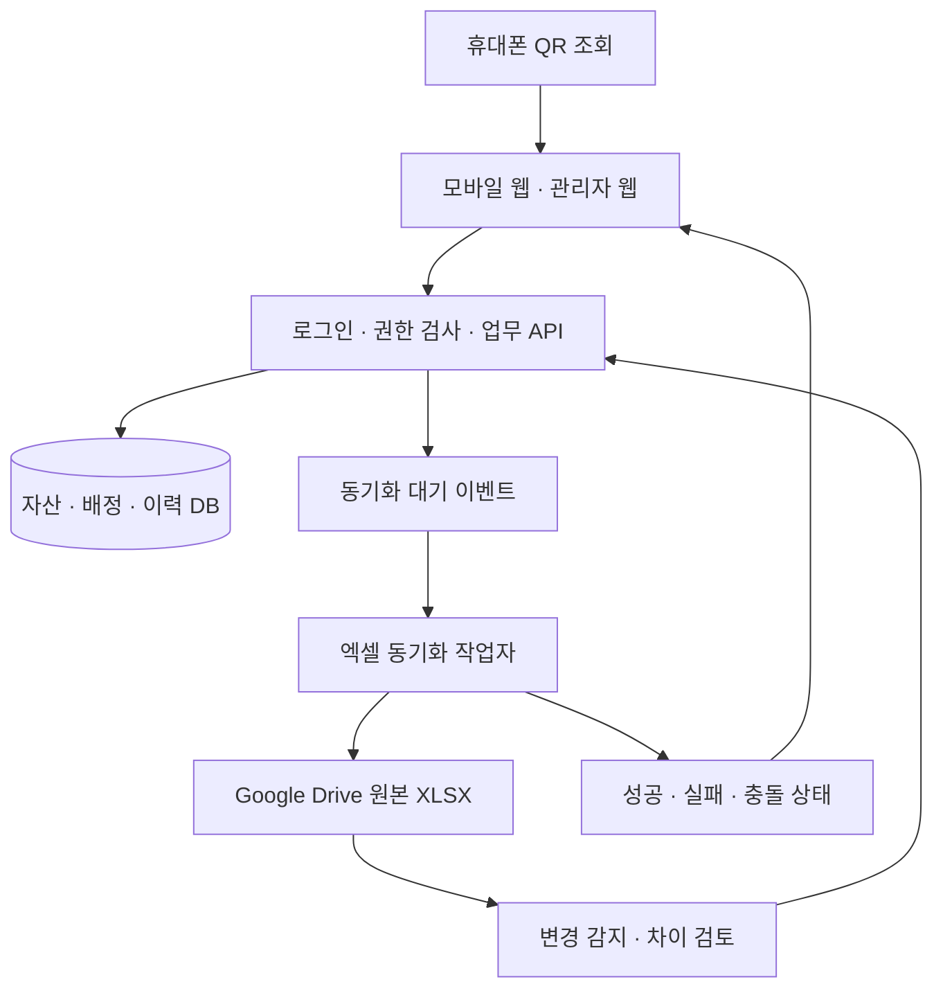
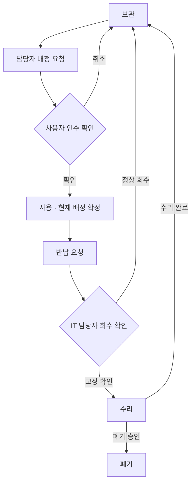

# Bumjin IT 자산관리 프로그램 설계서

작성일: 2026-10-08 · 버전: 1.2 · 범위: 개발 착수용 설계안 · Synology LDAP 화면 확인 반영

## 1. 목표와 핵심 결정

휴대폰으로 자산에 붙은 QR을 촬영하면 PC 사양, 구매 정보, 현재 배정 사용자, 위치, 변경 이력을 조회한다. 앱에서 자산을 등록하면 고유 ID와 QR이 생성되고 Google Drive의 `Bumjin_IT자산관리대장.xlsx`에 해당 사업부 행이 추가된다. 사용자 배정·반납·이동도 앱에서 기록하고 엑셀에 반영한다.

**권장 구조: 모바일 웹/PWA + 업무 API + 관계형 DB + 엑셀 동기화 작업자.** DB를 운영 원장으로 두고 기존 엑셀은 같은 양식을 유지하는 자동 갱신 대장으로 사용한다. 앱 정보는 저장 즉시 갱신하고, 엑셀은 비동기 반영한다. 동시 편집이 있는 XLSX 파일 자체를 실시간 DB처럼 사용하지 않는다.

QR은 자산 상세 페이지의 고정 주소다. 사용자 이름·구매일·사양을 QR에 직접 넣지 않으므로 담당자가 바뀌어도 QR을 다시 출력할 필요가 없다.

이 문서는 설계 제안이다. 원본 엑셀 변경, 앱 구현, 서비스 배포는 수행하지 않았다.

## 2. 원본 파일에서 확인한 구조

참조: [Bumjin_IT자산관리대장.xlsx](https://docs.google.com/spreadsheets/d/1_HmN3HS9Cbnt3cbS4T4_a4TyfcX1mI0S/edit)

2026-10-08에 내려받은 원본의 시트·셀·수식을 확인했다. 총 14개 시트이며 헤더 병합, 사업부별 다른 열 위치, 수식 집계가 존재한다.

| 원본 시트 | 앱에서의 역할 | 1차 처리 |
|---|---|---|
| 1.보유현황 | 부서별 PC·모니터·태블릿·SW 집계 | 양식 보존, 연동 검증 |
| 2.전산 유지보수 | 업체·계약·기간·비용 관리 | 보존, 2차 기능 |
| 3.BJM PC 현황 / 4.BJE PC 현황 / 5.BJC PC 현황 | PC 마스터 | 등록·조회·배정·반납·동기화 |
| 3_1.BJM 모니터 현황 / 4_1.BJE 모니터 현황 / 5_1.BJC 모니터 현황 | 모니터 마스터 | 이관 구조 확보, 2차 화면 |
| BJM 통계 / BJE 통계 / BJC 통계 | 사용·보관·폐기 집계 | 기존 수식 보존 및 결과 대조 |
| BJM IP 현황 | IP 관련 별도 관리 | 원본 보존, 세부 연동은 별도 설계 |
| 6.TABLET PC 현황 | 태블릿 마스터 | 원본 보존, 2차 화면 |
| 7.복합기 | 임대·설치위치·비용·사용량 | 원본 보존, 2차 기능 |

### 반드시 반영할 원본 특성

1. PC의 `상태`는 A/B/C/D 노후 등급이다. `사용/보관/폐기`와 별도 필드로 설계한다. 확인한 수식 기준은 3년 미만 A, 3년 이상 B, 5년 이상 C, 10년 이상 D이며 기준일 미입력은 공란이다.
2. BJM은 구매일자, BJE는 구입년월, BJC와 모니터·태블릿은 제조일자를 사용한다. 제조일을 구매일로 표시하지 않는다. 구입년월은 일자 정밀도를 월로 보존한다. 다른 날짜도 실제 구매증빙 확인 전 일자 정확성을 단정하지 않는다.
3. BJE/BJC PC의 B열 헤더는 `사업부`지만 실제 값은 자산번호 형식이다. 사업부는 시트에서 결정하고 B열은 기존 관리번호로 가져온다.
4. BJM PC와 여러 모니터 시트에 관리번호 중복이 있다. 기존 관리번호만으로 UPDATE하거나 QR을 만들면 다른 장비를 잘못 연결할 수 있다.
5. 사용자 칸에는 직원 이름뿐 아니라 서버·공용 용도도 들어 있다. 모든 값을 직원으로 자동 생성하지 않는다.
6. 소프트웨어 구성은 사업부마다 다르다. BJM의 OfficeKeeper/V3와 BJE·BJC의 SAP/백신/Docuone을 별도 매핑한다.
7. 보유현황의 BJM 집계에서 SAP와 V3가 같은 T열을 참조하는 수식이 확인된다. 원본 BJM PC T열은 V3다. 기존 집계 오류 후보로 분류하고 업무 확인 후 수정한다. 원본 수식이 있다는 이유만으로 결과를 정답으로 삼지 않는다.

## 3. 시스템 구성

실시간의 의미는 **확정된 자산 등록·배정 변경이 앱에 즉시 보이는 것**이다. PC에 실제 로그인한 사람을 QR만으로 알아내는 기능은 아니다. 인수 확인·정기 실사로 실제 사용자와 대장 정보를 맞춘다. Windows 접속 사용자 자동 수집은 향후 별도 에이전트 연동 범위다.

운영 목표값(개발 후 검증): 일반 자산 조회 2초 이내, 배정 확정 즉시 앱 재조회에 반영, 정상 상태에서 엑셀 60초 이내 반영. API 제한·파일 용량·망 환경에 따라 튜닝하며 보장값으로 선약하지 않는다.

## 4. 실제 업무 흐름

### 4.1 신규 PC 등록 → QR 출력 → 엑셀 추가

1. IT 담당자가 사업부, 유형, 제조사, 모델, 일련번호, 사양, 구매 정보를 입력한다.
2. 신규 관리번호와 일련번호의 중복 후보를 검사한다. 일련번호가 없는 장비는 사유를 남기고 등록 가능하다.
3. 서버가 불변 `asset_id`를 발급한다. 자산, 최초 이력, 동기화 이벤트를 하나의 DB 트랜잭션으로 저장한다.
4. QR과 사람이 읽을 수 있는 관리번호 라벨을 생성한다. 생성 실패 시 자산을 재등록하지 않고 라벨만 재생성한다.
5. 엑셀 작업자가 사업부 PC 시트의 데이터 구역에 새 행을 넣고 서식·노후 등급 수식을 적용한다.
6. 업로드 후 다시 읽어 자산 값과 수식을 검증한다. 화면에는 `앱 저장 완료 / 엑셀 반영 완료`를 구분해 보여준다.
7. 라벨을 부착한다. 신규 자산 기본 상태는 `보관`이며 배정 시 `사용`으로 바뀐다.

### 4.2 QR 촬영 → 자산 상세 조회

휴대폰 기본 카메라로 QR을 열고 회사 계정으로 로그인하면 원래 자산 페이지로 복귀한다. 자산 상세에는 관리번호, 유형, 제조사·모델, 일련번호, CPU/RAM/SSD/HDD/GPU, OS, 구매일 또는 구입년월, 제조일, 노후 등급, 현재 배정 사용자/공용 용도, 부서, 위치, 최종 실사일, 동기화 상태를 보여준다.

QR은 `https://<운영도메인>/a/<추측하기 어려운 토큰>` 형태로 설계한다. 운영도메인은 배포 때 확정한다. 토큰은 인증을 대체하지 않으며, 폐기 자산은 폐기 표시와 권한에 맞는 조회만 제공한다.

### 4.3 배정·인수·반납·이동

- QR 조회만으로 배정자를 변경하지 않는다. 사용자가 `내가 사용 중`을 누르면 확인 요청을 생성한다.
- 사용자 인수 확인 또는 사유를 남긴 IT 담당자 확정으로 현재 배정을 갱신한다. 확정 전에는 기존 배정을 유지한다.
- 자산당 활성 배정은 하나만 허용한다. 한 직원에게 여러 PC·모니터 배정은 허용한다.
- 사용자 변경 시 이전 배정 종료와 새 배정 시작을 같은 트랜잭션으로 처리한다.
- 공용 PC는 개인 대신 부서·공용 목적·관리 책임자를 기록한다. 서버를 직원명으로 등록하지 않는다.
- 반납은 실제 회수 확인 후 처리한다. 폐기·분실은 사유·처리자·시각을 필수로 남기고 이력은 삭제하지 않는다.
- 사업부 간 이동 시 asset_id와 QR은 유지한다. 엑셀은 원래 시트 행 제거와 대상 시트 행 생성을 한 파일 버전에서 반영한다. 과거 이력은 DB에 보존한다.

## 5. 화면 설계

| 화면 | 주요 내용 | 주요 동작 |
|---|---|---|
| 대시보드 | 사업부·부서·유형별 보유, 사용/보관/수리/폐기/분실, 노후 등급, 미확인 자산 | 목록 필터 이동 |
| 자산 목록 | 관리번호·모델·사용자·부서·위치·상태·구매일, 동기화 상태 | 검색·필터·일괄 QR 출력 |
| 자산 등록/수정 | 원본 항목 기반 입력, 유형별 사양, 날짜 종류와 정확도 | 저장·중복 확인·QR 생성 |
| 모바일 상세 | 자산 핵심 정보, 현재 배정, 이력, 최종 실사일 | 인수 확인·반납 요청·오류 신고 |
| 사용자별 자산 | 직원별 PC·모니터·태블릿 | 입퇴사 지급·회수 확인 |
| 실사 | QR 스캔, 배정자·위치 대조, 일치/불일치/미확인 | 사진·메모·확인일 기록 |
| 엑셀 연동 관리 | 마지막 반영 시각, 대기/실패/충돌, 원본 차이 | 재시도·차이 승인·이관 검토 |
| 이력 조회 | 등록·사양 수정·배정·반납·이동·수리·폐기 | 이전/이후 값과 처리자 조회 |

모바일 상세 정보 순서: `관리번호·상태 → 현재 사용자·부서·위치 → 제조사·모델 → 구매/제조 정보 → PC 사양 → 변경 이력`. 인수 확인과 반납 요청 버튼은 로그인 사용자 권한에 따라 표시한다.

## 6. 엑셀 필드 매핑

PC 데이터는 6행부터 시작한다. 병합 헤더의 보조 열은 실제 데이터 의미로 해석한다.

| 앱 필드 | BJM PC | BJE PC | BJC PC | 처리 규칙 |
|---|---|---|---|---|
| 기존 관리번호 | B | B | B | legacy_asset_no, 중복 허용하여 이관 |
| 사업부 | 시트 BJM | 시트 BJE | 시트 BJC | B열 헤더와 혼동 금지 |
| 부서 / 사용자 | C / D | C / D | C / D | 직원·공용 용도 분리 |
| 장비 유형 / 제조사 | E / F | E / F | E / F | 병합 헤더의 실제 데이터 기준 |
| 모델 / 일련번호 | G / H | G / H | G / H | 일련번호 원문 보존 |
| CPU / 비트 | I / J | I / J | I / J | 비트 값은 원문 의미 보존 |
| RAM / SSD / HDD / GPU | K / L / M / N | K / L / M / N | K / L / M / N | 원문 + 정규화 용량 병행 |
| OS / 에디션 | O / P | O / P | O / P | Win11 / Pro 등 |
| OFFICE / 한글 | Q / R | Q / R | Q / R | 설치 여부·버전 원문 보존 |
| 보안·업무 SW | S OfficeKeeper, T V3 | S SAP, T 백신, U Docuone | S SAP, T 백신, U Docuone | 소프트웨어별 개별 항목 |
| 노후 등급 | U | V | V | 기존 기준일에 따른 수식 |
| 기타 | 없음 | W | W | BJM 추가값은 확장정보 |
| 비고 | V | X | X | 자유 텍스트 |
| 구매일 / 구입년월 | W 구매일자 | Y 구입년월 | 기존 열 없음 | BJC 구매일은 확장정보 |
| 제조일 | 기존 열 없음 | 기존 열 없음 | Y 제조일자 | 구매일 대체 금지 |
| 사용 여부 | X | Z | Z | 노후 등급과 분리 |

모니터 공통 매핑: B 관리번호, C 부서, D 사용자, E 인치, F 모델, G 일련번호, H 노후 등급, I 제조일자, J 비고, K 사용 여부. 제조사와 구매일은 기존 전용 열이 없어 확장정보로 저장한다.

태블릿 매핑: B 기존 번호, C 사업부가 포함된 부서 문자열, D 사용자, E 유형, F 제품군, G 모델, H 일련번호, I OS, J 정품사용여부, K OFFICE, L 등급, M 기타, N 비고, O 제조일자, P 사용 여부. C열 사업부 분리는 확인 가능한 접두어만 적용하고 원문을 남긴다.

### 원본 양식과 새 필드의 공존

기존 시트 이름·헤더·열 순서·병합·너비·인쇄 설정·수식을 보존한다. 앱 전용 구매일, 위치, asset_id, QR 토큰, 배정 시각, 상세 상태는 새 `앱_자산확장정보` 시트에 저장하는 방안을 채택한다. 이 시트 추가는 실제 구현 시 반영할 설계다.

확장정보 열: asset_id, 사업부, 자산유형, 기존관리번호, 신규고유관리번호, 원본시트, 일련번호, 구매일, 구매일정밀도, 제조일, 위치, 상세상태, 최종실사일, 갱신버전. 인적 상세 정보와 감사 이력 전체는 DB에서 관리한다.

행 번호는 진단 정보일 뿐 영구 식별자로 쓰지 않는다. 동기화 시 직전 파일 버전과 행 지문을 대조한다. 중복 번호·일련번호 공란 때문에 행을 확정할 수 없거나 수동 정렬·편집이 감지되면 동기화를 중지하고 대조 화면으로 보낸다. 자동으로 추정 매칭하지 않는다.

기존 상태 집계 호환을 위해 사용→사용, 보관→보관, 폐기→폐기를 유지한다. 신규 수리/분실은 기존 상태 열에도 명시하고 확장정보에 저장한다. 기존 통계가 수리/분실을 누락하므로 2개 항목을 추가하는 확장안으로 구현하며, 총 보유·폐기 포함 여부를 별도로 정의해 대조한다. 임의로 수리를 보관, 분실을 폐기로 치환하지 않는다.

## 7. 데이터 모델

| 테이블 | 핵심 필드 | 규칙 |
|---|---|---|
| assets | id(UUID), asset_no, legacy_asset_no, division_id, type, manufacturer, model, serial_raw, serial_normalized, purchase_date, purchase_precision, manufacture_date, lifecycle_status, location_id, version | 신규 asset_no 고유, 기존 번호 별도 보존 |
| pc_specs | asset_id, cpu, architecture_raw, ram_raw/gb, ssd_raw/gb, hdd_raw/gb, gpu, os, os_edition | asset_id당 1건 |
| asset_software | asset_id, product, version_raw, installed_status | O/공란을 무조건 라이선스 적법성으로 해석하지 않음 |
| employees / departments / divisions | 직원키, 성명, 직급, 재직상태, 조직코드 | 이름만으로 직원 동일성 판단 금지 |
| assignments | id, asset_id, assignee_type, employee_id 또는 department_id, purpose, requested_at, accepted_at, ended_at, confirmed_by | 자산당 활성 배정 1건 |
| asset_events | asset_id, event_type, before_json, after_json, actor_id, occurred_at, reason | 추가 기록 방식, 일반 사용자 수정 불가 |
| inspections | asset_id, inspector, inspected_at, observed_user, observed_location, result, note | 배정 이력과 독립 |
| qr_labels | asset_id, token_hash, issued_at, revoked_at, print_count | 토큰 폐기·재발급 가능 |
| excel_bindings | asset_id, drive_file_id, sheet_name, row_hint, row_fingerprint, export_version | row_hint는 식별키가 아님 |
| sync_outbox / sync_jobs | event_id, asset_id, asset_version, status, retries, error, file_version | 이벤트 중복 처리 방지 |
| import_batches / import_rows | 원본 파일 버전, 시트, 행, 원문, 검증결과, 처리결과 | 재이관 중복 방지·오류 추적 |

노후 등급은 조회일과 원본 기준일로 계산하며 구매일 미확인은 미확인으로 표시한다. 제조일 기준 등급은 그 기준을 함께 표시한다. 신규 PC 구매일이 있더라도 BJC 기존 등급 기준을 무단 변경하지 않는다.

## 8. 동기화·충돌·복구 설계

### 기본 운영: 앱 입력 → DB → 동일 Drive XLSX 갱신

- XLSX는 셀 API 대상이라고 가정하지 않고 파일 내려받기·수정·동일 파일 내용 갱신 방식으로 구현 검증한다. Google Sheets로 자동 변환하지 않는다.
- 파일당 작업자 1개만 쓰도록 직렬화한다. 짧은 시간의 여러 변경은 묶어서 반영한다.
- DB 저장과 outbox 기록은 원자적으로 처리한다. 엑셀 장애가 있어도 앱 저장은 유지하고 반영 대기 상태를 표시한다.
- 갱신 직전 원본 버전·수정시각·해시를 확인한다. 서비스의 조건부 쓰기 지원을 구현 단계에서 검증한다. 안전한 비교 후 쓰기를 보장하지 못하면 운영 파일 수동 편집을 제한하고, 수동 수정은 별도 입력본으로 받는다. 확인-업로드 사이의 경쟁 조건을 단순 버전 조회로 해결했다고 간주하지 않는다.
- 업로드 전 백업과 검증을 수행하고 성공 후 동일 파일을 읽어 검증한다. 재시도는 같은 이벤트가 새 행을 중복 생성하지 않도록 멱등 처리한다.
- 실패 시 자동 재시도와 관리자 수동 재시도를 제공한다. 충돌은 덮어쓰지 않고 보류한다.
- 파일 수정 라이브러리와 계산 엔진은 원본 보존 시험 후 선정한다. 수식 문자열 보존만으로 계산 완료라 표시하지 않는다. 집계 캐시 재계산 및 Excel에서의 실제 표시 결과를 검증한다.

### 엑셀 직접 수정 → 앱 반영

1차는 자유로운 양방향 자동 덮어쓰기를 제공하지 않는다. 필요 시 관리자가 수정본을 가져오면 변경 전·후 차이를 확인하고 승인한 항목만 DB에 반영한다. 구매일·사용자·관리번호·사업부 변경과 행 삭제는 각각 업무 이벤트로 처리한다. 엑셀 행 삭제를 곧바로 자산 폐기로 해석하지 않는다.

앱과 수정본이 같은 필드를 바꿨으면 충돌 처리한다. 직원 식별과 중복 번호 문제가 해결되지 않은 행은 제외 사유를 보여주고 별도 검토한다. 이 절차 후 DB에서 검증된 내용을 다시 운영 대장에 반영한다.

## 9. 기존 데이터 이관

1. 원본 파일 백업과 해시 기록 → 시트별 헤더·데이터 구간 인식.
2. 원문 그대로 스테이징 적재. 병합 헤더·수식·공란·합계행을 자산 행과 분리한다.
3. 기존 번호 중복, 일련번호 중복 후보, 날짜 종류·정밀도, 부서·사용자·공용 용도를 검증한다. 일련번호는 원문과 대소문자 정규화 값을 함께 보유한다.
4. 검토 후 실제 장비마다 불변 asset_id를 부여한다. 기존 관리번호를 조용히 수정하거나 중복 행을 삭제하지 않는다.
5. 신규 고유관리번호 규칙 예시: BJ-PC-000001 / BJ-MON-000001. 사업부 이동에도 번호가 바뀌지 않도록 사업부를 번호에 종속시키지 않는다. 기존 번호도 검색 가능하게 한다.
6. 사업부·장비유형·사용 여부별 건수를 대조한다. 원본 집계 수식 오류는 별도 차이 목록으로 남긴다.
7. 기존 사용자 배정은 `이관됨·실사 미확인`으로 기록한다. 실제 최초 지급일을 이관일로 만들어내지 않는다.
8. BJE PC 소규모 표본부터 QR 출력·현물 실사·반영을 검증한 후 전체 확대한다. 공용 장비, 중복 번호, 날짜 누락, 폐기 자산을 표본에 포함한다.

## 10. 권한과 운영

| 권한 | 허용 범위 |
|---|---|
| IT 관리자 | 자산 등록·수정·배정 확정·반납·폐기·이관·동기화 관리 |
| 부서 담당자 | 담당 부서 조회·실사·배정 변경 요청 |
| 일반 직원 | 본인 자산 조회·인수 확인·반납/오류 신고, 다른 자산은 정책상 허용한 최소 정보 |
| 감사/조회자 | 허용 사업부의 대장·이력 읽기 |

회사 계정 인증, 서버측 사업부·역할 권한 검사, HTTPS를 적용한다. QR에 직원명·사번·IP·일련번호를 직접 넣지 않는다. 구매금액·계약·IP 정보는 권한별로 제한한다. Drive 인증정보는 서버에만 보관한다.

휴대폰이 접속할 수 있는 HTTPS 경로가 필요하다. 사내망/VPN 전용과 외부 접속+회사 로그인 중 회사 정책에 맞춰 결정한다. 오프라인에서는 오래된 사용자 정보를 최신으로 표시하지 않고 온라인 확인이 필요하다고 안내한다.

DB 백업, 엑셀 버전 백업, 감사 이력, 동기화 실패 알림을 운영 항목에 포함한다. 첨부 파일·인적 정보 보유기간, 백업 주기와 복구 목표는 회사 정책에 맞춰 확정한다.

## 11. API 초안

| 메서드·경로 | 기능 | 핵심 제약 |
|---|---|---|
| GET /api/assets | 검색·필터·페이지 조회 | 사업부 권한 적용 |
| POST /api/assets | 자산 등록 | 멱등키·중복검증·outbox |
| GET /api/assets/:id | 상세 조회 | 현재 배정·날짜 기준 포함 |
| PATCH /api/assets/:id | 수정 | expected_version, 충돌 시 409 |
| GET /api/qr/:token | QR 대상 조회 | 로그인·권한 검사 후 응답 |
| POST /api/assets/:id/labels | QR 발급·재출력 | 재출력은 동일 자산 유지 |
| POST /api/assets/:id/assignment-requests | 배정 요청 | 기존 활성 배정 유지 |
| POST /api/assignment-requests/:id/accept | 인수 확정 | 동시 배정 방지 |
| POST /api/assets/:id/return-requests | 반납 요청 | 요청만으로 보관 전환 금지 |
| POST /api/return-requests/:id/confirm | 회수 확정 | 담당자 권한·이력 기록 |
| POST /api/assets/:id/inspections | 실사 기록 | 배정 자동 변경 금지 |
| POST /api/imports/preview 및 /:id/commit | 이관 검토·확정 | 원본 버전·차이 승인 |
| GET /api/sync-jobs 및 POST /:id/retry | 연동 상태·재시도 | 중복 행 생성 금지 |

## 12. 개발 순서와 완료 조건

### 1차 MVP

PC 3개 사업부 이관 → 로그인·권한 → 자산 등록·목록·상세 → QR 발급·휴대폰 조회 → 배정·인수·반납 → 동일 XLSX 자동 갱신 → 이력·충돌·재시도 → 소규모 실사 순서로 개발한다. 엑셀 보존·동시 편집 가능성은 초기에 기술 검증한다.

### 2차 확대

모니터·태블릿 화면, 사용자별 일괄 지급·회수, 실사 캠페인, 계약 만료, 복합기 임대·비용, IP 관리, PC 정보 자동 수집을 추가한다. 일반 웹브라우저 입력만으로 로컬 PC의 CPU·RAM·일련번호가 자동 수집된다고 가정하지 않는다. 자동 수집은 검토된 스크립트나 사내 배포 에이전트와 별도 수집 API가 필요하다.

### 검수 기준

- BJM/BJE/BJC 신규 PC가 각각 올바른 시트·열에 1회만 추가된다.
- 사용자 배정 변경 후 동일 QR로 최신 확정 사용자를 볼 수 있다.
- 두 담당자가 동시 배정해도 활성 배정은 하나만 남는다.
- 구매일 없는 BJC PC는 제조일을 구매일로 보여주지 않는다.
- 관리번호가 같은 모니터 두 대가 서로 다른 asset_id와 QR을 가진다.
- 엑셀 업로드 실패·재시도·프로세스 재시작 후 행 중복이나 데이터 유실이 없다.
- 엑셀 수동 편집 충돌을 감지하면 자동 덮어쓰기를 중지한다.
- 원본 14개 시트와 기존 레이아웃·수식·인쇄 설정이 보존된다. 승인된 확장만 추가된다.
- 집계 수식 재계산 결과와 DB 집계가 합의된 포함 기준으로 일치한다.
- 일반 직원의 직접 URL/API 접근에도 다른 자산의 제한 정보가 노출되지 않는다.
- 반납·폐기 후 이전 사용자 이력이 조회되며, 라벨을 재출력해도 자산은 중복 생성되지 않는다.

## 13. 개발 착수 시 확정할 운영 값

설계 기본값은 앱을 운영 원장으로 사용하고 XLSX는 자동 갱신 대장으로 유지하는 것이다. 착수 시 회사 로그인 방식, 휴대폰 접속 경로, 운영 파일 수동 편집 권한, 관리번호 표시 규칙, 사용자 마스터 공급원, 사업부 조회 범위, 배정 승인 담당자를 확정한다. 이 값들은 기능 설계를 바꾸기보다 배포·권한·이관 설정으로 관리한다.

## 14. Synology LDAP Server 사용자 연동

### 확정 범위와 데이터 소유권

사용자 확인에 따라 제품은 Synology NAS의 **LDAP Server**로 확정한다. Synology Directory Server/AD용 속성을 그대로 적용하지 않는다. 후속 첨부와 앞선 첨부 화면을 함께 확인했으며 화면에서 확인된 설정은 15절에 기록했다. 실제 NAS 연결·속성 조회는 아직 수행하지 않았다.

LDAP는 계정 정보의 원본이고, 앱은 직원 프로필·자산 배정·이력의 원본이다. 1차 범위는 읽기 전용 사용자 동기화와 기존 엑셀 사용자 매핑이다. LDAP 계정으로 앱에 로그인하는 기능은 별도 옵션으로 둔다. 앱에서 LDAP 계정을 생성·수정·삭제하지 않는다.

### 필드 매핑

| 앱 필드 | LDAP 후보/출처 | 적용 규칙 |
|---|---|---|
| ldap_uid | uid | Synology 사용자 이름은 로그인 계정명이며 한글 실명이라고 가정하지 않음 |
| email | mail | 선택 값, 누락 허용 |
| ldap_dn | 검색 결과 DN | 일반 구조 uid=계정명,cn=users,Base DN. 실제 검색 결과를 사용하며 영구 식별자로 삼지 않음 |
| directory_object_id | entryUUID 등 실제 조회 가능한 안정적 식별 속성 | 지원·조회 권한·계정명 변경 시 유지 여부를 사전 검증한 뒤 선택 |
| display_name | DSM 사용자 관리의 설명 열에 대응하는 LDAP 속성 | 화면에서 한글 실명 확인. 실제 LDAP 속성명은 조회 결과와 대조한 후 설정 |
| department / title | 확인된 LDAP 속성 또는 앱 직원 프로필 | 미제공 시 앱에서 관리. 파일 접근 그룹을 부서로 자동 해석하지 않음 |
| directory_status | 검증된 계정 상태 속성과 전체 동기화 결과 | 잠금·만료·비활성·조회 실패를 구분, 퇴사 여부와 동일시하지 않음 |

Synology 공식 사용자 관리 문서에서 uid(계정명), mail(이메일), DN 구조를 확인했다. 한글 실명·부서·불변 식별자·상태 속성은 현장 스키마 확인이 필요하다. **NAS 계정명만 있다면 앱에 ‘계정명 ↔ 한글 이름’ 연결표를 만들면 되므로, 한글 이름 속성 부재가 연동 불가를 뜻하지 않는다.**

앱 내부 employee_id(UUID)를 자산 배정 FK로 사용한다. directory_id + directory_object_id에 고유 제약을 둔다. 안정적 식별 속성을 얻지 못하면 임시로 directory_id + uid를 매핑하되, 계정 변경·삭제 후 재생성은 수동 검토한다. 같은 uid가 재사용돼도 과거 자산이 자동 승계되어서는 안 된다.

### 최초 이름 매핑과 화면

1. LDAP 사용자 목록을 읽기 전용으로 가져오고 시스템·서비스 계정은 검토 후 배정 대상에서 제외한다.
2. 기존 엑셀 사용자의 원문을 유지하면서 이름·직급 후보를 분리한다.
3. 실명·이메일·부서 등 확인된 정보를 대조하여 후보를 제시한다. 이름 일치만으로 확정하지 않으며 동명이인은 반드시 담당자가 선택한다.
4. 검토 화면: 원본 시트 / 기존 사용자 문자열 / LDAP uid / 한글 이름 / 부서 / 후보 근거 / 확정·보류.
5. 확정 후 사용자 선택창은 ‘김건희 · geonhee.kim · 정보운영팀’처럼 표시한다. 예시는 가상 계정이며 실제 계정값이 아니다.
6. 엑셀 사용자 열은 기존 이름·직급 표기 규칙을 유지한다. employee_id 및 LDAP 연결은 DB가 관리하고 비밀번호는 엑셀·DB에 저장하지 않는다.

### 동기화와 계정 생명주기

제안 기본값은 1시간 간격 전체 동기화와 관리자 ‘지금 동기화’다. 자산 배정은 LDAP 주기와 무관하게 앱에 즉시 반영한다. 이는 프로그램 기능 설계이며 현재 예약 작업을 생성한 것은 아니다.

LDAP 페이지 전체 수신·완료를 확인한 후에만 목록 비교를 확정한다. 시간초과·권한 오류·일부 페이지 누락 시 마지막 정상 상태를 유지하고 동기화 실패로 표시한다. 전체 동기화에서 사라진 계정도 즉시 삭제하지 않고 ‘연결 확인 필요’로 보류한다. 퇴사나 비활성 확정 시 신규 배정을 막고 회수 대상에 올리며 기존 자산·사용 이력은 보존한다.

동기화는 LDAP 소유 필드만 갱신한다. LDAP에 없는 부서·직급 등 앱 관리 필드를 빈값으로 덮어쓰지 않는다. 계정 이름 변경이 확인돼도 QR과 employee_id는 유지한다. 부서 이동 시 현재 부서와 과거 배정 시점 부서를 구분해 보존한다.

### 연결 설정과 접근 경로

- 설정 화면: 서버 FQDN, 포트, Base DN, 사용자 검색 Base, 읽기용 Bind DN, 비밀 저장소 참조, CA 인증서, 사용자 검색 필터, 필드 매핑, 동기화 주기.
- 제안 기본 연결은 LDAPS 636이며 NAS에서 활성화·인증서 구성이 필요하다. 서버 인증서의 신뢰 체인과 호스트명을 검증한다. 실제 환경에서 지원을 검증한 경우 StartTLS 방식도 선택 가능하다.
- 읽기 범위를 제한한 연동 전용 계정 사용을 우선한다. 사용 환경에서 조회 권한을 시험하고 root 계정을 기본 설정으로 하드코딩하지 않는다.
- 앱 서버에서 NAS로 사내망 또는 VPN을 통해 연결한다. 휴대폰은 HTTPS 앱에만 접속하며 LDAP 포트를 인터넷에 공개하지 않는다.
- NAS IP/도메인, Base DN, 계정 속성 표본은 구현 시 설정한다. 비밀번호는 대화나 문서에 기재하지 않고 운영 환경에서 입력한다.

### DB/API 확장

directory_connections: 연결 설정·상태·마지막 정상 동기화 시각. 비밀번호 원문 대신 비밀 저장소 참조를 저장한다.

employee_directory_links: employee_id, directory_id, directory_object_id, uid, current_dn, first_seen_at, last_seen_at, sync_status. 계정 재생성과 변경 이력을 별도 기록한다.

directory_sync_runs: 시작/종료, 전체 페이지 완료 여부, 생성/변경/누락 후보 건수, 오류. mapping_reviews: 원본 사용자값, 후보 직원, 매핑 근거, 승인자·시각.

API 초안: GET /api/employees?query= (사용자 검색), POST /api/directories/:id/test (관리자 연결 시험), POST /api/directories/:id/sync (동기화), GET /api/employee-mappings (후보 조회), POST /api/employee-mappings/:id/confirm (매핑 확정). 검색 필터 값은 LDAP 필터 문법에 맞게 이스케이프하며 사용자 입력으로 DN을 직접 조합하지 않는다.

LDAP 로그인 옵션을 추가할 경우 검색으로 실제 사용자 DN을 찾고 암호화된 연결에서 사용자 자격증명으로 인증한다. 빈 비밀번호는 거절하고 비밀번호는 저장·로그 기록하지 않는다. 인증 성공과 앱 관리자 권한 부여는 별개다. 로그인 실패와 디렉터리 장애를 구분하고 잠금 정책에 맞춰 시도 횟수를 제한한다.

### 추가 검수 기준

- uid가 영문이고 LDAP에 실명이 없어도 앱 이름 매핑 후 자산을 정상 배정한다.
- 동명이인을 구분하고 기존 ‘서버/공용’ 값을 직원으로 자동 생성하지 않는다.
- 계정명 변경, 삭제·동일 uid 재생성, 디렉터리 연결 실패를 각각 시험한다.
- 부분 동기화 실패가 전 직원 비활성 처리로 이어지지 않는다.
- LDAP 변경이 앱 부서·직급·자산 이력을 임의로 지우지 않는다.
- 계정 비활성 후에도 실제 회수 전에는 자산이 자동 반납되지 않는다.

공식 참고: [Synology LDAP 사용자 관리](https://kb.synology.com/tr-tr/DSM/help/DirectoryServer/ldap_user?version=7), [LDAP Server 연결 설정](https://kb.synology.com/en-global/DSM/help/DirectoryServer/ldap_server?version=7). 조회일 2026-10-08. 설치 버전과 실제 조회 가능한 속성은 구축 때 확인한다.

## 15. 첨부 화면 기반 현장 설정과 매핑 확정

2026-10-08 제공된 image(1).png 사용자 관리 화면과 image(2).png 설정 화면을 확인했다. 아래는 화면 관찰 결과이며 연결 성공을 뜻하지 않는다.

| 항목 | 확인값 | 구현 시 적용 |
|---|---|---|
| 제품 / 서버 역할 | LDAP Server / Provider | 사용자 목록 조회 원본 |
| LDAP 서버 활성화 | 체크됨 | 네트워크 접근 가능 여부는 별도 시험 |
| DSM 접속 주소 | 10.10.30.220:5000 | 관리 화면 주소. LDAP 연결 포트와 구분 |
| 설정 FQDN | ldap.bumjin.local | 앱 서버의 DNS 해석과 인증서 이름 일치 확인 |
| Base DN | dc=ldap,dc=bumjin,dc=local | 사용자 검색 범위 설정에 사용 |
| 화면의 Bind DN | uid=root,cn=users,dc=ldap,dc=bumjin,dc=local | 관리자 DN 참고값. 운영 연동은 최소 조회 권한 전용 계정 우선 |
| 사용자 목록 열 | 이름 / 설명 / 이메일 / 상태 | 아래 매핑 적용 |
| 목록 항목 수 | 360개 | 직원 수로 단정하지 않음. 전체 동기화 건수 대조 참고 |

화면의 Consumer용 SSL/TLS 항목은 비활성 영역이다. 이것만으로 Provider의 LDAPS 활성화·인증서 정상 여부를 확정하지 않는다. 제안 접속 URI는 ldaps://ldap.bumjin.local:636이며 실제 연결 시험 전까지 후보 설정으로 취급한다.

### 회사 데이터 매핑

- **이름 열 → 로그인 ID(uid)**: 계정 식별·검색에 사용한다.
- **설명 열 → 직원 표시 이름**: 현재 화면에서 한글 실명이 들어 있다. 기존 엑셀 사용자명과 대조할 기본 후보 값이다. 화면 레이블이 설명이라고 LDAP 속성명도 description이라고 단정하지 않는다. 읽기 시험에서 실제 속성과 값을 대조한다.
- **이메일 열 → email(mail)**: 동명이인 구분의 보조 정보로 사용하되 이메일도 유일·불변이라고 가정하지 않는다.
- **상태 열 → 계정 상태**: 정상과 비활성화됨이 관찰된다. 조회 속성과 DSM 표시의 대응을 시험한다. 화면의 상태를 직급·재직 여부로 치환하지 않는다.
- **부서·직급 → 기존 엑셀/앱 직원 프로필**: 제공 화면에 전용 열이 없어 LDAP에서 제공된다고 확정할 수 없다. 직원 매핑 승인 과정에서 부서·직급을 정리한다.

사용자 선택 UI: ‘실명 · 계정 ID · 부서’. 동일 이름이 여러 계정에 존재하면 이메일과 조직을 함께 표시하고 담당자가 확정한다. 설명이 공란이거나 실명이 아닌 경우는 수동 확인 대상으로 둔다.

목록에는 admin 비활성 계정과 공용·업무용으로 보이는 계정이 포함돼 있다. 모든 360개 항목을 직원으로 변환하지 않는다. 계정 유형(person/shared/service/system/unknown), 자산 배정 대상 여부, 검토자를 앱에 기록한다. 문자열 형태만으로 자동 제외를 확정하지 않는다.

### 구현 전 최소 연결 시험

1. 앱 서버에서 설정 FQDN의 DNS와 NAS 접근 경로를 확인한다.
2. 암호화 연결과 서버 인증서를 검증하고 읽기 전용 계정의 검색 권한을 시험한다.
3. 사용자 검색 Base 후보 cn=users,dc=ldap,dc=bumjin,dc=local에서 표본을 조회한다. 실제 트리 구조를 확인한 뒤 확정한다.
4. uid/mail, 실명이 저장된 실제 속성, 안정적 식별 속성, 상태 속성을 화면 값과 대조한다. 비밀번호 속성은 요청·저장·출력하지 않는다.
5. 정상·비활성·공용 계정 표본을 구분하고 전체 조회 완료 여부와 건수를 검증한다.
6. 기존 엑셀 이름과 후보 매핑 미리보기를 만든 후 승인된 연결만 적용한다.

이 단계에서 필요한 운영 비밀번호는 서버의 비밀 설정에 입력한다. 설계 문서·QR·엑셀에는 넣지 않는다. 현재 작업은 설계 업데이트이며 NAS 설정 변경이나 계정 접근은 수행하지 않았다.
