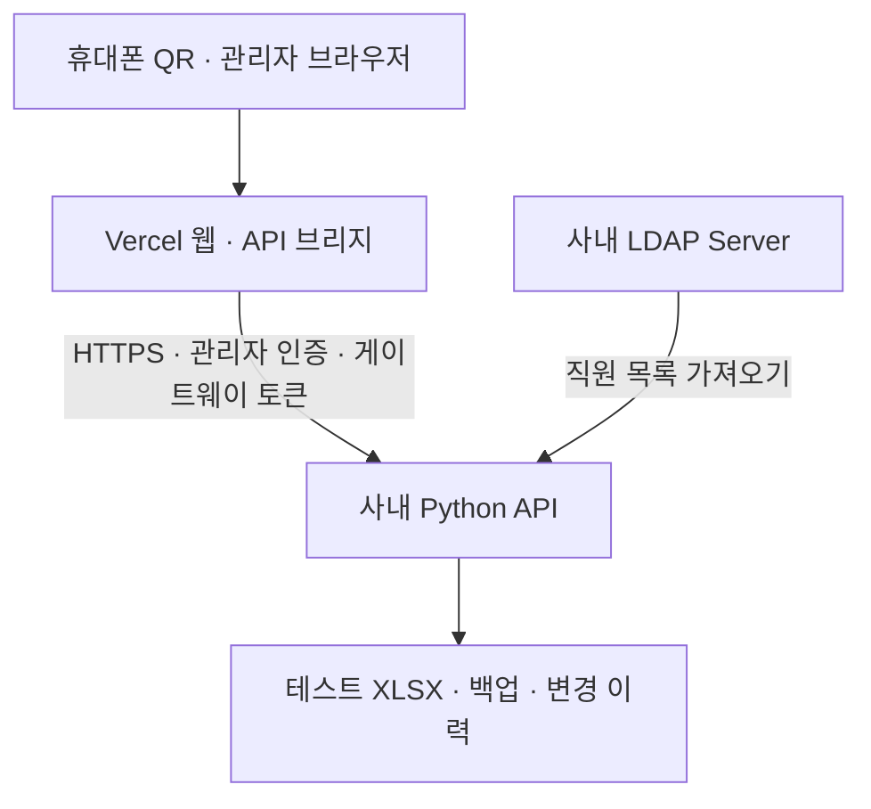

# Bumjin ITAM

기존 Excel 자산대장을 사용하는 IT 자산관리 파일럿입니다. 웹은 Vercel에, Excel 저장과 LDAP 연결은 사내 서버에 배치합니다. 별도 DB 서버가 필요하지 않습니다.

## 구성



Vercel 서버리스 로컬 디스크는 XLSX 영구 저장소로 사용하지 않습니다. 웹만 배포해도 화면은 제공되지만 자산 조회·저장은 사내 API 연결 후 동작합니다. LDAP 로그인은 아직 구현하지 않았으며, 현재는 관리자 테스트 계정 로그인과 LDAP 사용자 목록 가져오기를 지원합니다.

## 구현된 기능

- BJM/BJE/BJC PC 목록·검색·필터·상세
- PC 등록·사양/사용자/사용 상태 수정 → Excel 저장
- UUID 기반 QR 조회·출력, 중복 기존 관리번호 구분
- 변경 이력, 백업, 버전 충돌 감지, Excel 수식 입력 차단
- 읽기 전용 LDAPS 사용자 가져오기 스크립트
- Vercel API 브리지와 연결 오류 표시

## 1. 사내 API 실행

1. 테스트 Excel을 `backend/data/Bumjin_IT자산관리대장.xlsx`에 복사합니다. 실제 직원 정보가 담긴 파일은 Git에 포함하지 않습니다.
2. Python 3.11 이상을 준비하고 backend 폴더에서 실행합니다.

```powershell
cd backend
$env:PUBLIC_BASE_URL = 'https://실제-Vercel-사이트-주소'
$env:BACKEND_GATEWAY_TOKEN = Read-Host 'Vercel과 동일한 게이트웨이 토큰'
powershell -ExecutionPolicy Bypass -File .\start.ps1
```

사용자 이름은 admin이며 실행 때 12자 이상 비밀번호를 입력합니다. 환경변수 예제 파일은 자동 로드되지 않습니다. 실제 값을 PowerShell/서비스 설정에 입력하세요. 상세 사용법과 LDAP 설정은 [backend/README.md](backend/README.md)에 있습니다.

사내 서버에 HTTPS 역방향 프록시를 구성하고 Vercel 서버에서 접근할 수 있는 경로를 제공해야 합니다. `10.x.x.x` IP나 사내 `.local` 이름을 Vercel BACKEND_URL로 바로 넣으면 연결되지 않습니다. LDAP 포트를 외부로 공개하는 방식은 사용하지 않습니다. API는 인증과 게이트웨이 토큰으로 보호하고 회사 정책에 맞는 접근 경로를 구성하세요.

## 2. Vercel 배포

1. Vercel → Add New → Project → `Bumjin_ITAM` 저장소 Import.
2. Framework Preset: **Other**, Root Directory: 저장소 루트.
3. Build Command: `npm run build`. Output Directory는 **Override를 끄고 비워둡니다**. 빌드 스크립트가 Vercel Build Output API v3 형식의 `.vercel/output`에 정적 웹과 API 함수를 생성합니다. `public`이나 `dist`를 지정하지 않습니다.
4. Environment Variables:

| 변수 | 값 |
|---|---|
| BACKEND_URL | 사내 API의 실제 HTTPS 주소 |
| BACKEND_GATEWAY_TOKEN | 사내 API와 동일한 긴 랜덤 토큰 |

5. Deploy. 이후 사내 API의 PUBLIC_BASE_URL을 배포된 실제 웹 주소로 맞추고 재시작합니다.
6. 웹에서 PC 목록·수정·QR 조회를 확인합니다. 환경변수 변경 후 Vercel 재배포가 필요합니다.

프런트엔드 소스에는 비밀번호·실제 자산·직원 목록을 넣지 않습니다. 공개 저장소와 정적 웹에는 UI 코드만 포함됩니다. 사용자 정보는 인증된 API 응답으로 조회합니다.

## 3. 데이터 운영

앱용 XLSX의 숨김 AZ/BA열과 앱 관리 시트는 유지하세요. QR ID와 LDAP uid가 들어 있습니다. 앱 사용 중 Excel 직접 편집을 중지하고 한 서버·한 프로세스만 파일을 작성하도록 운영합니다. 저장 전 backups 폴더에 사본을 만듭니다.

Google Drive 파일 자동 갱신은 아직 미구현입니다. 지금은 사내 XLSX를 운영하고 앱에서 다운로드한 파일을 Drive 테스트 파일의 새 버전으로 수동 반영합니다. Drive를 원장으로 쓰는 자동 동기화는 별도 인증·버전 보호 작업자가 필요합니다.

## 검증

```sh
npm test
npm run build
```

```powershell
cd backend
.\.venv\Scripts\python.exe test_app.py
```

백엔드 테스트에는 로컬 테스트 XLSX가 필요하며 임시 사본에만 쓰기를 수행합니다. LDAP와 사내 HTTPS 연결은 실제 환경에서 검증해야 합니다.

## 다음 단계

사내 API HTTPS 경로 연결 → Vercel 환경변수 설정 → 실명 속성 확인 및 LDAP 가져오기 → 기존 사용자 이름 매핑 → Google Drive 자동 동기화 순서로 진행합니다. 모니터 편집·직원별 권한·인수/반납 승인은 후속 범위입니다.
